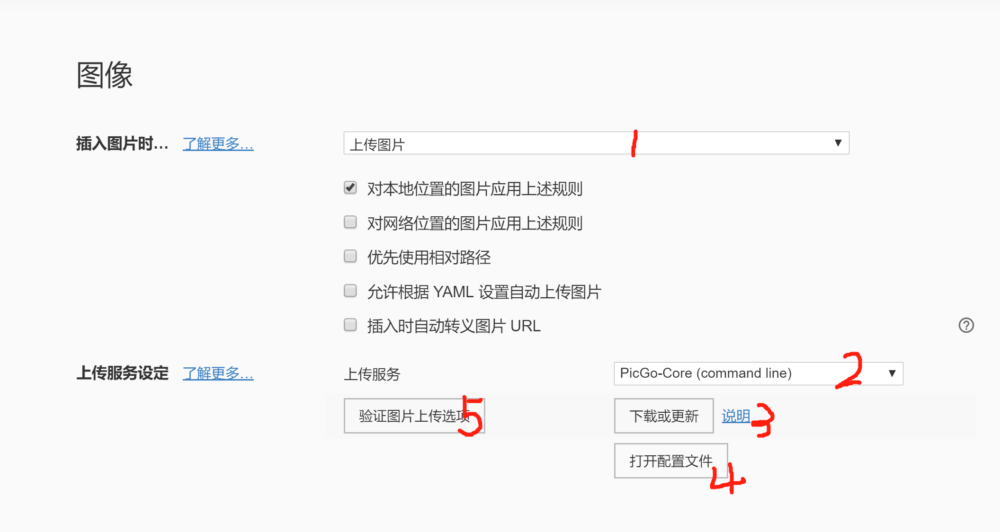

在使用markdown写作文档时，图片的插入经常是一件头疼的事情。本地图片的路径设置有一点小小的问题就会导致图片载入失败，原文件移动时图片文件也要跟随着相对移动（如果使用相对路径的话）等等的缺点。如果将图片上传到网络服务器中，只要计算机能够联网，便可以做到一劳永逸。

<!-- more -->

Typora设置图片上传的步骤分为以下5步



[token创建](https://github.com/settings/tokens)

配置文件设置

```json

{
  "picBed": {
    "github": {
      "repo": "用户名/图床仓库名",
      "token": "",
      "path": "img/",
      "customUrl": "https://raw.githubusercontent.com/用户名/图床仓库名/master",
      "branch": "master"
    },
    "current": "github",
    "uploader": "github"
  },
  "picgoPlugins": {}
}
```

